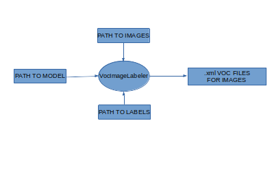

# VocImageLabeler
This tool currently working both on nvidia <b>jetson(nano)</b> and you need jetson sdk installed 
https://github.com/dusty-nv/jetson-inference <br />
It's work only with ssd-mobilenet-v1. <br /> <p> </p>
Or on <b>PC</b> by using pytorch-ssd project(check on github).
It's work only with ssd-mobilenet
## Scenario of usage 
When you need to learn model to object detection your algorithm looks like this(jetson dusty script): <br />
1. Gather images,
2. Create txt file with labels,
3. Label images(as voc),
4. Train model

But when you are testing trained model you see that he is detecting objects but still is not good at this. Then you need to do is: <br />
1. Gather more images,
2. Label them(as voc),
3. Train model

Of course  labeling take time. Perhaps good idea it would be tried to label new images by previously trained model and then <br />
manually fix/add labels for not correctly detected objects. And this is what this software does. It is taking path to model, path to folder with images,
path to labels and generate .xml voc files. Of course not all files will be correctly label because model is not ideal, but it can speed up process. <br />
 <br />

## Running software
It was tested on jetson nano with ubuntu 18.04 with jetson dusty(L4T-R31.0) and jetson sdk 4.3.
It was tested on PC with Geforce 1060 6 GB on Ubuntu 20.04.
Let's say that in /home/user we have directories: pictures, models. In picuters we have our data set, in model directory model and labels text file. <br />
1. Run script main.py
```
python3 main.py
```
2. Script will first ask if you want to run it on jetson nano or on PC.
3. Script is using text interface he will ask for three paths, for example we enter:
```
Path to images:/home/user/pictures
Path to labels:/home/user/models/labels.txt
#in case of jetson
Path to model:/home/user/models/ssd-mobilenet.onnx
#in case of Pc we use .pth files of ssd model
Path to model:/home/user/models/mb1-ssd-Epoch-199-Loss-0.7120061775048574.pth
```
4.After script will end his work(sipmly program will end with 0) we go to /home/user/pictures and we will see voc xml files.
<br />
xml files names is the same like pictures. Of course because model is not ideal not all images will be have coresponding xml file(no detections in image) or in some files we can find mistakes.
<br />
Program is working but is still in development, refactors of code etc.